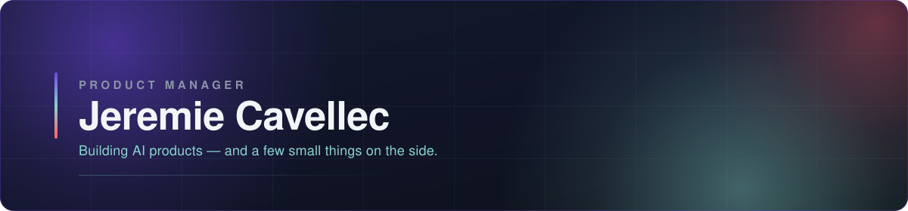

  

 

## Hello

I'm a **Product Manager working primarily on AI products** — the craft of turning a model
that *can* do something into a product someone actually reaches for. There's no settled
playbook for it yet. That's precisely what makes it worth doing.

Before product, I spent a decade in software engineering. It taught me the expensive
lesson: the hard part was never the building — it was deciding what deserved to be built.
So I moved to the side of the table where that gets decided.

 

## How I think about the work

- **Start from the problem, not the feature.** The best specs are mostly evidence.
- **Ship the smallest thing that settles the argument.** Opinions are cheap; usage isn't.
- **Write it down.** A decision that isn't written didn't happen.
- **AI is a material, not a garnish.** Design for what it gets wrong, not just what it gets right.

 

## What's on this profile

A handful of small personal projects and things I've built for other people — side
experiments, favours, weekend ideas.

<table>
<tr>
<td width="50%" valign="top">

### [AMTARC](https://github.com/supremjerem/amtarc)

Website for a French sports-shooting club — public site plus an admin back-office.

`Next.js` `NestJS` `Prisma` `PostgreSQL`

</td>
<td width="50%" valign="top">

### [Ardoise AMTARC](https://github.com/supremjerem/ardoise_amtarc)

Replaces the paper slate behind the club bar: members see what they owe, till managers
record purchases and payments.

`TypeScript` `Web app`

</td>
</tr>
<tr>
<td width="50%" valign="top">

### [Cashalot](https://github.com/supremjerem/cashalot)

Personal dashboard for income, expenses and savings — built to retire a spreadsheet.

`Vue 3` `No build step`

</td>
<td width="50%" valign="top">

### [Yourmine](https://github.com/supremjerem/yourmine)

Paste a YouTube link, get an MP3 or WAV. Web UI, CLI and a Docker Compose stack.

`TypeScript` `Docker`

</td>
</tr>
<tr>
<td width="50%" valign="top">

### [Pong](https://github.com/supremjerem/pong)

Pong on plain HTML5 Canvas. No dependencies, no build step, no excuses.

`JavaScript` `Canvas`

</td>
<td width="50%" valign="top"></td>
</tr>
</table>

 

## Trophies

 

## Contribution snake

<picture>
  <source media="(prefers-color-scheme: dark)" srcset="https://raw.githubusercontent.com/supremjerem/supremjerem/output/github-snake-dark.svg" />
  <source media="(prefers-color-scheme: light)" srcset="https://raw.githubusercontent.com/supremjerem/supremjerem/output/github-snake.svg" />
  
</picture>

 

 

### Let's talk products

